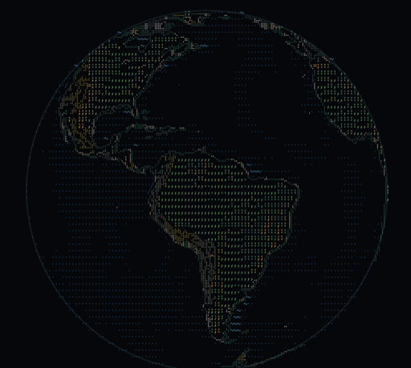

<div align="center">

# glyphsphere

**Un planeta navegable, hecho de caracteres.**



Platanus Build Night — Bogotá @ Buk

</div>

---

Hacker:

- Andres Esteban Rodriguez Avila ([@Andss-ye](https://github.com/Andss-ye))

## Qué es

`glyphsphere` dibuja la Tierra en una grilla de caracteres monoespaciados. Arrastrás para girar el
planeta, hacés zoom con la rueda, y seguís bajando hasta que el globo deja de verse y estás sobre
una calle — todo con la misma proyección continua y el mismo modelo de interacción.

No es un conversor de imágenes a ASCII: un conversor toma píxeles y elige caracteres por
luminancia, mientras que `glyphsphere` **conoce la geometría** (sabe que eso es una costa, que
aquello es un río, que esa banda es una curva de nivel) y elige cada carácter porque significa
algo. Combina tres registros de glifo con roles fijos — braille para líneas finas, cuadrantes para
bordes de área, ASCII semántico para relleno y marcadores.

## Características

- **Zoom continuo** de 80 000 km a 200 m con una sola proyección, sin transiciones
- **Realce hipsométrico** con bandas, curvas de nivel, realce solar y sombra costera
- **Escala urbana** con calles, uso de suelo y manzanas
- **Funciona offline** — Natural Earth incluido, sin API keys para el planeta base
- **Preparado para otros cuerpos** — la Tierra no está cableada en ningún lado
- **Contexto geoespacial para agentes de IA** — servidor MCP incluido, ver abajo

## Para agentes de IA

Como el pipeline **conoce la geometría** en vez de promediar píxeles, la misma consulta puede
responderse en texto en lugar de en glifos. `@glyphsphere/agent` hace eso:

```
LOCATION  33.4489S 70.6693W  (earth)
SURFACE   land · high plain · 579 m
TERRAIN   slope 1° facing WSW · local relief 1505 m
COAST     ~95 km W
NEAR      Santiago 2 km ENE (5.7M) · San Bernardo 17 km S (247k)
SUN       down 75.8° · solar time 00:15
```

~70 tokens, sin red, sin API key, y **determinista** — lo que lo hace usable dentro de un eval.
Trae un servidor MCP sin dependencias (`describe_location`, `render_view`) que se enchufa a
Claude Code, Claude Desktop o Cursor.

Lo que no tiene ningún otro mapa: el mismo `render` dibuja la consulta como grilla de
caracteres, así que **un humano puede mirar exactamente lo que el modelo recibió**.

```bash
pnpm --filter @glyphsphere/agent probe 4.711 -74.0721
```

Detalle en [`packages/agent/README.md`](packages/agent/README.md); el pitch completo en
[`PITCH.md`](PITCH.md).

## Documentación

El árbol completo de decisiones de diseño vive en `docs/`:

| | |
|---|---|
| [`ARCHITECTURE.md`](docs/ARCHITECTURE.md) | Pipeline, hilos, paquetes |
| [`REPOSITORY.md`](docs/REPOSITORY.md) | Dónde va cada archivo |
| [`RENDERING.md`](docs/RENDERING.md) | Los tres registros, atlas, backends |
| [`RELIEF.md`](docs/RELIEF.md) | Realce hipsométrico |
| [`CAMERA.md`](docs/CAMERA.md) | Proyección, zoom, paneo, LOD |
| [`DATA.md`](docs/DATA.md) | Fuentes geográficas y escala urbana |
| [`BODIES.md`](docs/BODIES.md) | Abstracción de cuerpo celeste |
| [`API.md`](docs/API.md) | Superficie pública |
| [`AESTHETIC.md`](docs/AESTHETIC.md) | Paleta, charsets, tipografía |
| [`ROADMAP.md`](docs/ROADMAP.md) | Fases y orden de trabajo |

Además, en la raíz: [`DEPLOY.md`](DEPLOY.md) para levantarlo en otra máquina y
[`PITCH.md`](PITCH.md) para el porqué.

## Instalación rápida

```bash
pnpm install
pnpm data:build     # 16 MB de Natural Earth + ETOPO1; no están en git
pnpm dev            # playground en :5173
```

Guía completa, incluido el servidor MCP y el despliegue, en [`DEPLOY.md`](DEPLOY.md).

## Estado

En desarrollo hacia v1, siguiendo [`docs/ROADMAP.md`](docs/ROADMAP.md).

## Contribuir

Leé [`CLAUDE.md`](CLAUDE.md) primero: contiene las restricciones de diseño del proyecto (registros
de glifo fijos, nada de geometría 3D, `core` sin DOM, etc.), y la mayoría de los PRs rechazados lo
son por romper una.

## Licencia

MIT. Fuente Iosevka bajo SIL OFL. Datos de [Natural Earth](https://www.naturalearthdata.com/)
(dominio público), GEBCO y ETOPO1.

---

## ⚠️ Deploying (Vercel, Render, etc.)

Deploy platforms like **Vercel**, **Render** or **Netlify** can only connect to
repositories **you own** — they can't be granted access to this organization repo.
To deploy while keeping your commits here, mirror your code to a personal repo:

1. Create a **personal** repository on your own GitHub account.
2. Point your local `origin` at **both** repos, so a single `git push` updates each one:

   ```bash
   # this org repo (keep it as a push target)...
   git remote set-url --add --push origin https://github.com/platanus-build-night/platanus-build-night-26-co-Andss-ye.git
   # ...and your personal repo
   git remote set-url --add --push origin https://github.com/<your-user>/<your-repo>.git
   ```

   From now on `git push` sends every commit to **both** repositories.
3. Connect your deploy service (Vercel, Render, …) to your **personal** repo and deploy from there.

Your commits stay mirrored here for judging, while the deploy runs from the repo you control.

Have fun! 🚀
